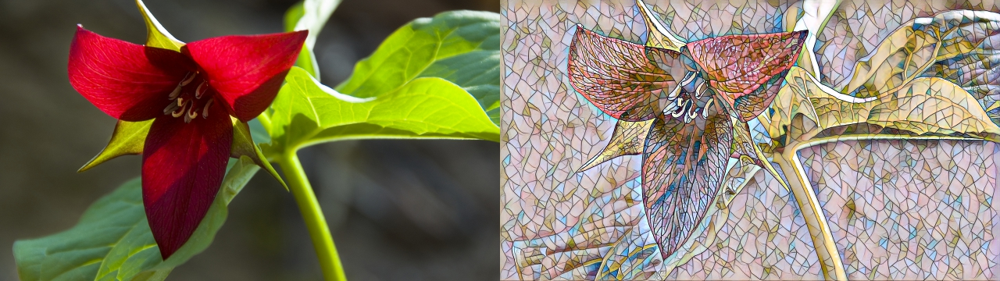

# PyTorchTOP

## Installation on Windows (no OSX support)

### Download LibTorch
From [https://pytorch.org/](https://pytorch.org/) download, 1.4 (stable), Windows, LibTorch, C++/Java, CUDA 10.1

### TouchDesigner Hack :/
I've tested TouchDesigner 2020.22080. From the place where you downloaded LibTorch, go to `libtorch\lib`. Then take `libiomp5md.dll` and overwrite the `libiomp5md.dll` for your TouchDesigner: `C:\Program Files\Derivative\TouchDesigner099\bin`.

Download PyTorchTOP.dll from the [Releases](https://github.com/DBraun/PyTorchTOP-cpumem/releases) page of this repo. Place it in the `Plugins` folder. Copy the DLL files from `libtorch\lib` into `Plugins` too. Congrats! You're done and can open PyTorchTOP.toe! The remaining steps are for building `PyTorchTOP.dll`.

## CUDA and CUDNN

From NVIDIA, install CUDA 10.1, which will create `C:\Program Files\NVIDIA GPU Computing Toolkit\CUDA\v10.1`. Download CUDA 7.6.5 for 10.1 and place the files into this folder too.

## CMake

I've tested [CMake](https://cmake.org/download/) 3.15.1. Inside the root of `PyTorchTOP-cpumem`:

    mkdir build
    cd build
    cmake -DCMAKE_PREFIX_PATH=/path/to/libtorch ..

where `/path/to/libtorch` should be the full path to the unzipped LibTorch distribution. Expected output:

	-- Selecting Windows SDK version 10.0.18362.0 to target Windows 10.0.
	x64 architecture in use
	-- Caffe2: CUDA detected: 10.1
	-- Caffe2: CUDA nvcc is: C:/Program Files/NVIDIA GPU Computing Toolkit/CUDA/v10.1/bin/nvcc.exe
	-- Caffe2: CUDA toolkit directory: C:/Program Files/NVIDIA GPU Computing Toolkit/CUDA/v10.1
	-- Caffe2: Header version is: 10.1
	-- Found cuDNN: v7.6.5  (include: C:/Program Files/NVIDIA GPU Computing Toolkit/CUDA/v10.1/include, library: C:/Program Files/NVIDIA GPU Computing Toolkit/CUDA/v10.1/lib/x64/cudnn.lib)
	-- Autodetected CUDA architecture(s):  7.5
	-- Added CUDA NVCC flags for: -gencode;arch=compute_75,code=sm_75
	-- Configuring done
	-- Generating done
	-- Build files have been written to: /path/to/PyTorchTOP-cpumem/build
If it works, you should end up with a Visual Studio solution inside `build`. Open `PyTorchTOP.sln`, select the Release build and press F5 to build the DLL and launch TouchDesigner.

### Neural Style Transfer

This project uses models that have been exported from [Fast Neural Style](https://github.com/pytorch/examples/tree/master/fast_neural_style). These are the steps to creating your own models. Install pytorch for python. Open `neural_style\neural_style.py`. Look for this line
    
    output = style_model(content_image).cpu()

Before it, write these lines:

	traced_script_module = torch.jit.trace(style_model, content_image)
	traced_script_module.save("traced_model.pt")

To save a new `traced_model.pt`, run:

    python neural_style/neural_style.py eval --content-image test640x360.jpeg --model saved_models/udnie.pth --output-image myoutput.png --cuda 1

Notice that you've provided a content image of a certain resolution, selected a model path, and enabled cuda. Because `test640x360.jpeg` is a 640x360 image, `traced_model.pt` will work with 640x360 images in TouchDesigner. Export a model for each size resolution you need. In TouchDesigner, select the model with the custom parameter `Modelfilepath`.

## Extra notes

Use the channel mix TOP to swap your red channel and blue channel before sending to PyTorchTOP.

## The Future
* Build a PURE GPU version based on the TouchDesigner CUDA sample project! Can `torch::from_blob` take a cudaArray pointer?
* Store the size of the model in the `*.pt` files and do error checking to make sure the input image matches this resolution.
